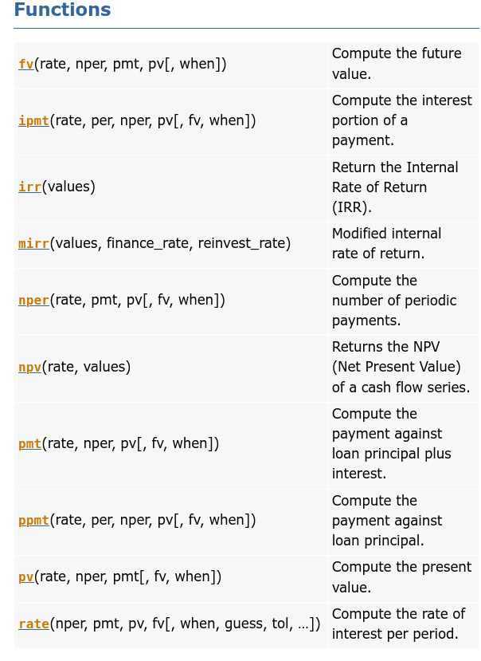

# Python Test Notes

## Loop over a dictionary
* `for key in a_dict.values()`
* `for key in a_dict or a_dict.keys()`
* `for (key, value) in a_dict.items()`

## Type Conversion
* `int(x:int, base:int)`
* `ord()`: character to integer
* `hex()`
* `oct()`: integer to octal string
* `dict()`: convert a tuple of order (key,value) into a dictionary
* `complex(real,imag)`: real numbers to complex(real,imag) number
* `chr(number)`: number to its corresponding ASCII character

## Sets
`thisset = {"apple", "banana", "cherry"}`
Set items are unordered, unchangeable, and do not allow duplicate values.

# Intro to Data Structures

## Series
Series is a one-dimensional labeled array capable of holding any data type (integers, strings, floating point numbers, Python objects, etc.). The axis labels are collectively referred to as the index. The basic method to create a Series is to call:

`s = pd.Series(data, index=index)`

* data: dict, ndarray, scalar
* index: list

`dtype: float64` shows the data type in your Series or DataFrame

## DataFrame
DataFrame is a 2-dimensional labeled data structure with columns of potentially different types. You can think of it like a spreadsheet or SQL table, or a dict of Series objects. It is generally the most commonly used pandas object. Like Series, DataFrame accepts many different kinds of input:

* dict of 1D ndarrays, list, dicts, or Series
* 2-D numpy.ndarray
* Structured or record ndarray
* A list of dicts
* A Series
* Another DataFrame

Along with the data, you can optionally pass index (row labels) and columns (column labels) arguments. If you pass an index and / or columns, you are guaranteeing the index and / or columns of the resulting DataFrame. Thus, a dict of Series plus a specific index will discard all data not matching up to the passed index.

If axis labels are not passed, they will be constructed from the input data based on common sense rules.

## Basic I/O with Python
* `pd.read_csv("path_to_file", index_col=0)`
* `df.to_csv("path_or_buf")`
* `pd.read_excel("path_to_xls", sheet_name="Sheet1")`
* `df.to_excel("path_to_file.xlsx", sheet_name="Sheet1")`

# Functions in numpy_financial

